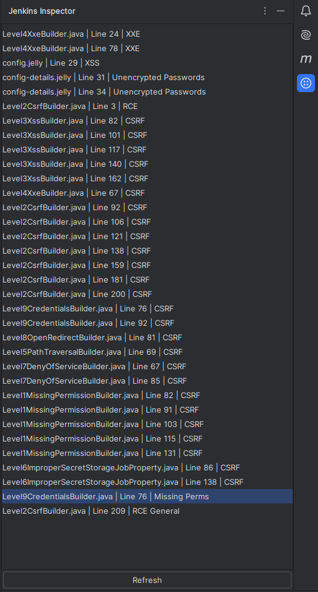

# Common Jenkins Vulnerabilities Enumerator

This is an `intelliJIDE` plugin that look for some vulnerable patterns in `Jenkins` plugins.

## How to install

You need first to compile the plugin using the following command:

```sh
./gradlew buildPlugin
```

then you can find the `Jar` file in `build/libs/common/vulnerabilitiesJenkins-1.0-SNAPSHOT.jar`.

Then go to:

```sh
File > Settings... > Plugin > the on the top there is the gear icon > Install Plugin from Disk...
```

and choose the `Jar` file you compiled earlier, then Save.

You will see a new icon appear on the right side panel.


## How to use
There are categories implemented right now, click the refresh button for one of the categories if any pattern that might
be vulnerable is found it will be added to the list of items under that category, `double click` to go to the vulnerable
line.